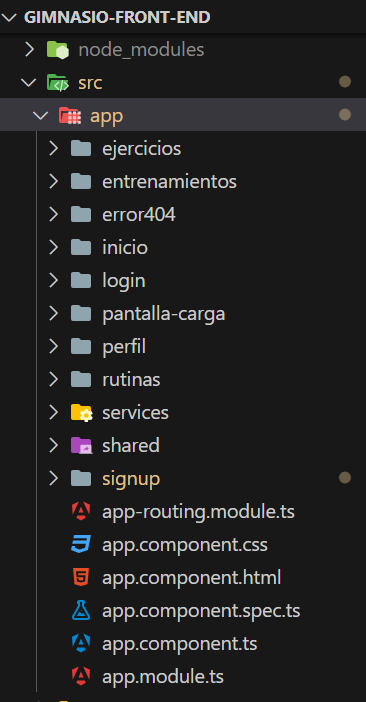

# Frontend Angular del Proyecto "Gimnasio con Spring-Angular"

Este es el repositorio del frontend Angular del proyecto [Gimnasio Spring-Angular](https://github.com/Cosas-de-Martin/Gimnasio-Angular-Spring/wiki). Accédase a la Wiki del mismo en el hipervínculo proporcionado para tener información sobre el proyecto al completo.

## Contenido

1. [Requisitos Previos](#requisitos-previos)
2. [Configuración del Proyecto](#configuración-del-proyecto)
3. [Ejecución del Proyecto](#ejecución-del-proyecto)
4. [Estructura del Proyecto](#estructura-del-proyecto)
5. [Funcionamiento del Proyecto](#funcionamiento)

## Requisitos Previos

Asegúrate de tener instalados los siguientes elementos antes de comenzar:

- Node.js: [Descargar e Instalar Node.js](https://nodejs.org/)
- Angular CLI: Instalar globalmente con `npm install -g @angular/cli`

Las versiones utilizadas en este proyecto fueron:
  - Angular 17.0.6
  - Rxjs 7.8.1
  - Bootstrap 5.3.2
  - Fontawesome 4.7.0
  - Chart.js 4.4.1
  - ng2-charts 5.0.4
  - Typescript 5.2.2

## Ejecución del Proyecto

Ejecute el proyecto localmente con el siguiente comando:

```bash
ng serve
```

Acceda a [http://localhost:4200](http://localhost:4200)

Asegurarse de estar conectado al [Backend]()

## Estructura del Proyecto

Dentro de la carpeta `src/app` se encuentra el código generado del proyecto: Los archivos del componente principal `app`, una carpeta de `services` para los servicos, una de `shared` para los archivos usados por múltiples componentes y una carpeta por sección del proyecto, con su correspondiente `module.ts`, `routing.module.ts` y una subcarpeta `componentes` con los componentes de Angular utilizados en cada caso.

La vista del usuario está dada por el template de `app.component.html`, que posee los templates de `pantalla-carga` y `shared/topbar`, a los que muestra según el valor de variables internas de `app.component.ts`, y un `router-outlet` que carga de manera dinámica el template del componente del módulo indicado en `app-routing.module.ts` según cómo varía la URL de la página.

La conexión a la API es manejada por el archivo `services/data.service.ts`, cuenta con la URL de ésta en el atributo `backendUrl`, los métodos utilizados y una serie de objetos `Subject` de Rxjs que emiten eventos dinámicamente para actualizar los datos de los componentes que requieran de ello.

En todo momento se utilizan los modulos de routing de Angular para actualizar la vista del usuario, desplegando una pantalla de carga en caso de tener que hacer una request al Backend y evitando tener que recargar la página sucesivas veces.



## Funcionamiento

Lo primero que hace la aplicación al cargar es verificar si hay el usuario que ha ingresado está loggeado o no. Toma como criterio para esto la variable `user_id` en el `sessionStorage` del navegador. Si esta posee algún valor, se lo toma como el `id` del usuario en cuestión y se lo redirige a la vista de `inicio` de la aplicación. Caso contrario, el usuario debe Registrase o Iniciar Sesión en el sitio.
Esto es manejado por el componente principal `app` y el servicio `services/sesion.service.ts`. También se utiliza al servicio `services/carga.service.ts` en todo momento, a lo largo del proyecto, para decidir si se ha de mostrar la pantalla de carga o no.

### Registro de Usuarios

Si nunca se ha registro, es lo primero que se ha de hacer. De esto se encarga la carpeta `signup`. Se le pide al usuario un nombre, apellido, correo electrónico (único), contraseña y confirmación de esta contraseña. Utilizando formularios reactivos de Angular, se verifica que los inputs cumpla con una serie de validaciones y se le informa al usuario lo que está ocurriendo al respecto.

Una vez registrado correctamente, el usuario es redirigido a la sección de Login para que pueda iniciar sesión.


### Login de Usuarios

Manejado por la carpeta `login`, le permite a un usuario ingresar sus credenciales para acceder al sitio. Una vez ingresados correo electrónico y contraseña correctos, se obtiene el `id` asociado a éste en la base de datos y se lo guarda en el `sessionStorage` como `user_id`, se utilizará posteriormente para acceder a todas las entidades en base de datos relacionadas con él.


### Inicio

Loggeado el usuario, se le redirige a la vista de `inicio`, del directorio de mismo nombre. Se obtienen algunos datos de éste con su id, se le muestra un mensaje de bienvenida a la aplicación y una barra de navegación en la parte superior de su pantalla, es propia de `shared/topbar`. La misma le permite acceder vía `routerLink`s a las distintas secciones del proyecto, así como cambiar algunos de sus datos o cerrar sesión si despliega el dropdown asociado a su nombre.


### Rutinas

Se listan los nombres de las rutinas del usuario, se le permite agregar nuevas, editar las existentes y eliminarlas. A cada rutina se le asocian un conjunto de entrenamientos, por lo que si se quiere crear alguno, es un requisito previo contar con al menos una rutina. Eliminar una de éstas implica eliminar todos los entrenamientos asociados a ella. Es manejado por la carpeta `rutinas`.


### Entrenamientos

Llevar su registro es la función principal de la aplicación. Se pueden encontrar los componentes utilizados en la carpeta `entrenamientos`. Se le permite al usuario agregar nuevos entrenamientos y ver sus datos de forma amigable ordenados descendentemente por la fecha de cada uno. Al agregar o editar un entrenamiento, el usuario ha de indicar la rutina a la que éste pertenece, la fecha, y por tantos ejercicios como haya realizado: el ejercicio en cuestión, el peso utilizado, las series y las cantidad de repeticiones hechas en cada una de ellas. 


### Ejercicios

Para cada uno de los ejercicios existentes, el usuario puede ver en forma de gráfico de líneas su progreso en términos de peso utilizado en función del tiempo. Toda la lógica de esta vista se encuentra en la carpeta `ejercicios`.


### Perfil

En este apartado la persona puede editar algunos de los datos con los que se ha registrado (por el momento sólo nombre y apellido). Tiene que dar valores válidos para los campos que corresponden y reingresar su contraseña para poder confirmar los cambios. Todo esto se encuentra en el directorio `perfil`.


### Error 404

Se tiene un componente específico para el caso en que, por algún motivo, el usuario sea redireccionado a una ruta distinta de las principales de `app-routing.module.ts`. Le permite volver al inicio o al login según corresponda. Puede encontrarse esto en la carpeta `error404`

